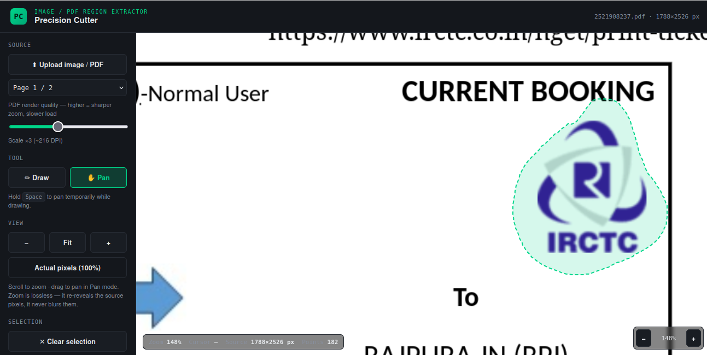

# Precise Freehand Image Cropper

A small, dependency-free web tool for making precise freehand crops of images in the browser.

**Highlights**

- Draw freehand selections over images and crop to the drawn shape.
- Works entirely client-side in the browser — no server or build step required.
- Simple, minimal UI based on a single `index.html` file.

**Usage**

1. Open the project by opening [index.html](index.html) in your browser, or serve the folder with a simple HTTP server (recommended for some browsers):

```bash
python3 -m http.server 8000
# then open http://localhost:8000 in your browser
```

2. Load an image using the provided UI.
3. Use the freehand drawing tool to mark the crop area.
4. Apply the crop and download or save the result.

**Development**

- No build tools required — edit `index.html` directly.
- Test by opening the file in modern browsers (Chrome, Firefox, Edge).

**Files**

- `index.html`: Main app UI and logic.
- `README.md`: This file.

**Contributing**

Contributions are welcome. Please open an issue to discuss major changes or submit a pull request with a clear description of the improvement.

**License**

MIT — see LICENSE (or add one) for details.

---

**Screenshot**

Below is a preview of the app UI:




